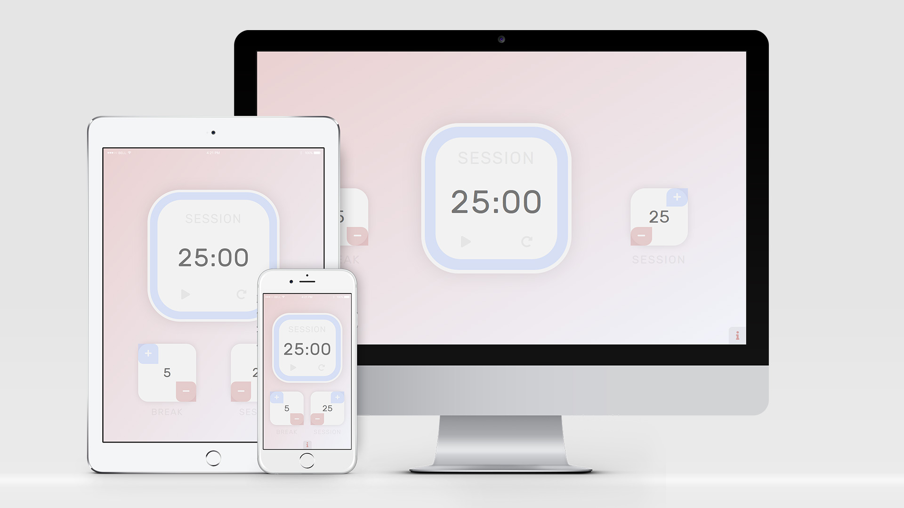

# POMODORO CLOCK

This project was part of the [FreeCodeCamp](https://learn.freecodecamp.org/front-end-libraries/front-end-libraries-projects/build-a-pomodoro-clock/) Front End Libraries Certification, which requires using a frontend framework to build a Pomodoro Clock. the project must fulfill all the user stories and get all the tests passed.

In this project, I'm using [React](https://reactjs.org/) with its new [Context API](https://reactjs.org/docs/context.html) and [Hooks](https://reactjs.org/docs/hooks-intro.html) to build a functional Pomodoro clock.

[Portal](https://reactjs.org/docs/portals.html) was used too, to add modal to the viewport.

This app uses [Local Storage](https://developer.mozilla.org/en-US/docs/Web/API/Window/localStorage) to save current timer state, to resume session/break in case of accidentally closed window.

Offline support provided by [create-react-app](https://reactjs.org/docs/create-a-new-react-app.html) built-in service worker.